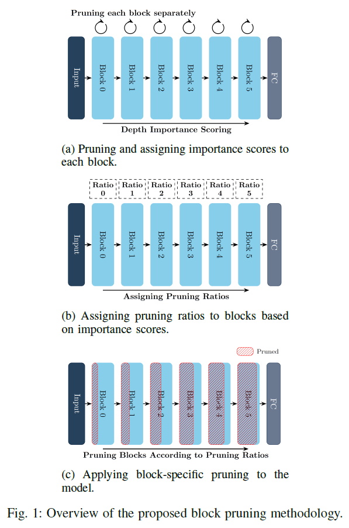

# Structured Nonuniform Pruning for Tiny Angle-of-Arrival Deep Learning Models

## Overview
This repository contains the code and dataset used for the paper **"Structured Nonuniform Pruning for Tiny Angle-of-Arrival Deep Learning Models"** presented at IEEE ICC 2025. Our work introduces a novel, structured, nonuniform, block-wise pruning technique that enables efficient deployment of deep learning models for **Angle of Arrival (AoA) estimation** in resource-constrained **IoT environments**.

## Abstract
Deploying deep learning (DL) models on IoT devices is challenging due to their limited computational resources. This work proposes a **structured, nonuniform pruning approach** that selectively prunes model blocks based on their contribution to overall performance. Applied to **MobileNetV3** for AoA estimation, our method achieves:

- **35.9X** reduction in parameter count
- **11.5X** reduction in model size
- **7.7X** reduction in multiply-accumulate operations (MACs)
<!-- - **4.7X** improvement in inference speed on CPU
- **2.4X** improvement in inference speed on GPU -->

while maintaining **minimal impact on accuracy**. We validate our approach using a real-world dataset collected from a **software-defined radio (SDR) testbed**.

# Algorithm Overview
The figure below illustrates the structured nonuniform pruning process:

<p align="center">
    
</p>

## Features
- **Structured Block-Wise Pruning**: Prunes entire blocks rather than individual parameters to maintain hardware efficiency.
- **Nonuniform Importance-Based Pruning**: Determines pruning intensity per block using a proposed importance metric.
- **Minimal Accuracy Degradation**: Ensures a balance between model compression and performance.
- **Optimized for IoT & SDR-Based AoA Estimation**: Enables real-time inference on edge devices with limited resources.

## Dataset
Our dataset consists of I/Q samples collected from a **real-world SDR testbed**, covering multiple modulations and sample rates.

- **Transmitter**: USRP X300 with 5.88 GHz antenna
- **Receiver**: Two synchronized USRP X300s (four-channel I/Q data)
- **500GB** dataset spanning **six modulation schemes** at **two sampling rates** (1M & 10M samples/sec)
- **Azimuth & elevation metadata** included for AoA estimation

## Installation
To use this repository, install the required dependencies:
```bash
pip install -r requirements.txt
```

## Usage
<!-- ### 1. Train the Baseline Model
```bash
python train.py --config configs/baseline.yaml
``` -->

### 1. Apply Structured Nonuniform Pruning
```bash
python python model_compress.py --device cuda --max_pruning_ratio 0.99
```

### 2. Reproduce The Results 
```bash
python python produce_results.py
```

<!-- ### 3. Fine-Tune the Pruned Model
```bash
python finetune.py --config configs/finetune.yaml
```

### 4. Evaluate the Pruned Model
```bash
python evaluate.py --model pruned_model.pth
``` -->

## Results
Key findings from our structured nonuniform pruning approach:

| Metric | Baseline Model | Pruned Model | Improvement |
|--------|--------------|--------------|-------------|
| **Parameter Count** | 548K | 15.26K | **35.9X Reduction** |
| **Model Size** | 2.1MB | 180KB | **11.5X Reduction** |
| **MACs** | 24.6M | 3.2M | **7.7X Reduction** |
<!-- | **CPU Inference Time** | 1X | **4.7X Faster** |
| **GPU Inference Time** | 1X | **2.4X Faster** | -->

## Citation
If you find this work useful, please cite our paper:
```bibtex
@inproceedings{hallaq2025tinyAoA,
  author    = {Mohammad Hallaq and Elsayed Mohammed and Fazal Muhammad Ali Khan and Alec Digby and Pasquale Leone and Ashkan Eshaghbeigi and Hatem Abou-Zeid},
  title     = {Structured Nonuniform Pruning for Tiny Angle-of-Arrival Deep Learning Models},
  booktitle = {IEEE International Conference on Communications (ICC)},
  year      = {2025},
}
```

## Acknowledgements
This research was supported by **Qoherent Inc., MITACS Accelerate, and Alberta Innovates**. We also thank the **University of Calgary WAVES Lab** for providing computational resources.

## Contact
For questions or collaborations, contact **Mohammad Hallaq** at [mohammad.hallaq@ucalgary.ca](mailto:mohammad.hallaq@ucalgary.ca) or create an issue in this repository.

---
### 🔗 Repository: [GitHub](https://github.com/Mohammad-Hallaq/Tiny-AoA)

